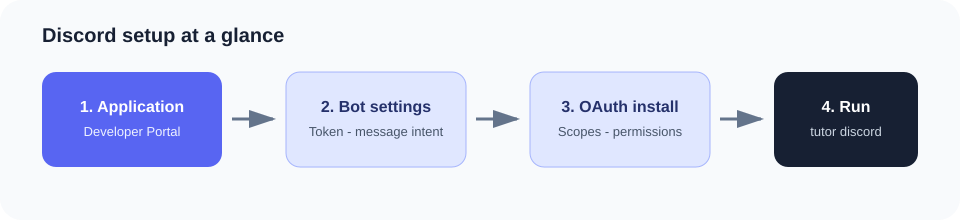
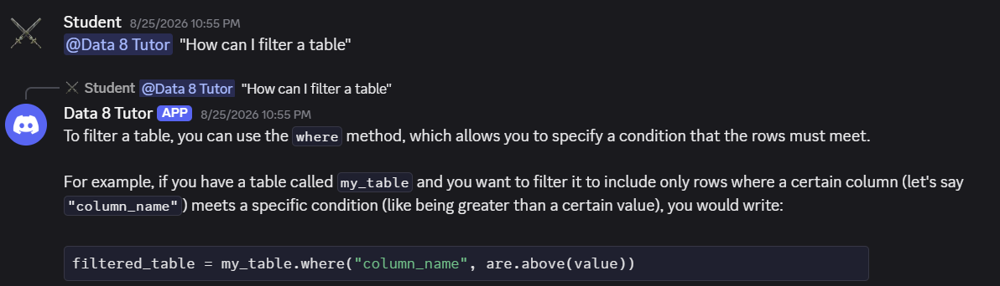
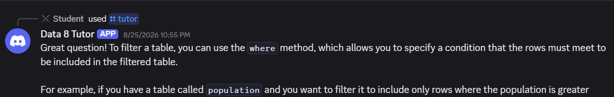

# Discord setup

The Discord tutor responds to mentions, direct messages, and the `/tutor`
slash command. Complete [Getting Started](getting-started.md) first.



## 1. Create the application

1. Open the [Discord Developer Portal](https://discord.com/developers/applications).
2. Select **New Application**, enter a name such as `Data 8 Tutor`, and create
   the application.
3. Open **Bot** in the left sidebar. Discord creates the bot user for new
   applications.
4. Select **Reset Token** if necessary, then copy the bot token.
5. Add the token to the project `.env` file:

    ```dotenv
    DISCORD_BOT_TOKEN=your-token
    ```

!!! warning
    Treat the bot token like a password. If it is exposed, reset it in the
    Developer Portal immediately.

## 2. Configure messages and commands

On the **Bot** page, enable **Message Content Intent** and save. The `/tutor`
slash command works without it, but the tutor needs this intent to read the
question included with an `@mention`.

Leave the Presence and Server Members intents disabled.

## 3. Install the bot

1. Open **OAuth2 → URL Generator**.
2. Enable these scopes:
    - `bot`
    - `applications.commands`
3. Enable these bot permissions:
    - View Channels
    - Send Messages
    - Send Messages in Threads
    - Read Message History
    - Embed Links
    - Use Slash Commands
4. Copy the generated URL and open it in a browser.
5. Select your server and authorize the application.

## 4. Optional: sync `/tutor` immediately

Without a guild ID, Discord may take up to an hour to publish the global slash
command. For immediate development sync:

1. Enable **Developer Mode** under Discord **User Settings → Advanced**.
2. Right-click the server name and select **Copy Server ID**.
3. Add it to `.env`:

    ```dotenv
    DISCORD_GUILD_ID=your-server-id
    ```

## 5. Run the tutor

```bash
pip install -r requirements.txt
python -m tutor ingest
python -m tutor discord
```

Leave the process running. You should see a message indicating that the Discord
tutor is ready.

## Use it in Discord

### Mention the tutor



### Use the slash command



- Mention it: `@Data 8 Tutor how do I use tbl.where?`
- Send the bot a direct message.
- Run `/tutor question: how do I use tbl.where?`

Stop the local process with **Ctrl+C**. The Discord interface always uses
student mode and does not expose solution files.
