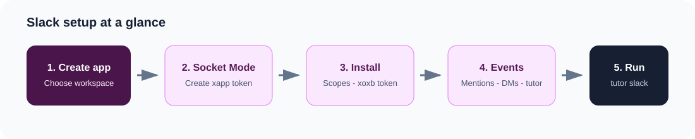

# Slack setup

The Slack tutor responds to mentions, direct messages, and the `/tutor` slash
command. It uses Socket Mode, so you do not need a public HTTPS endpoint.
Complete [Getting Started](getting-started.md) first.



## 1. Create the app

1. Open [Slack API Apps](https://api.slack.com/apps).
2. Select **Create New App → From scratch**.
3. Name the app, for example `Data 8 Tutor`, and select a workspace.

## 2. Enable Socket Mode

1. Open **Socket Mode** in the left sidebar and enable it.
2. Create an app-level token named `socket` with the `connections:write` scope.
3. Copy the token beginning with `xapp-` into `.env`:

    ```dotenv
    SLACK_APP_TOKEN=your-app-token
    ```

## 3. Add permissions and install

1. Open **OAuth & Permissions**.
2. Under **Bot Token Scopes**, add:
    - `app_mentions:read`
    - `chat:write`
    - `im:history`
    - `im:read`
    - `im:write`
    - `commands`
3. Select **Install to Workspace** and authorize the requested permissions.
4. Copy the **Bot User OAuth Token** beginning with `xoxb-` into `.env`:

    ```dotenv
    SLACK_BOT_TOKEN=your-bot-token
    ```

!!! warning
    Keep both Slack tokens in `.env`. If either token is exposed, rotate it in
    your Slack app settings.

## 4. Subscribe to messages

1. Open **Event Subscriptions** and enable events.
2. Under **Subscribe to bot events**, add:
    - `app_mention`
    - `message.im`
3. Save the event subscription settings.

## 5. Add the slash command and messages tab

1. Open **Slash Commands → Create New Command**.
2. Set the command to `/tutor`, the description to `Ask the Data 8 tutor`, and
   the usage hint to `your question`.
3. Open **App Home**. Under **Show Tabs**, enable **Allow users to send Slash
   commands and messages from the messages tab**.
4. Add the bot to a channel:

    ```text
    /invite @Data 8 Tutor
    ```

Use the display name you chose if it is different.

## 6. Run the tutor

```bash
pip install -r requirements.txt
python -m tutor ingest
python -m tutor slack
```

Leave the process running. You should see `Slack tutor starting (Socket Mode)`.

## Use it in Slack

- Mention it: `@Data 8 Tutor how do I use tbl.where?`
- Send the app a direct message.
- Run `/tutor how do I use tbl.where?`

Stop the process with **Ctrl+C**. The Slack interface always uses student mode
and does not expose solution files.
