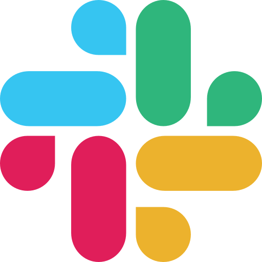

# Tutor Options

The project currently runs one Data 8 tutor through three interfaces. Each
interface uses the same course corpus, retrieval system, and tutoring engine.

## Choose an interface

<a class="option-card option-card--compact" href="interfaces/local-cli/">
  

    

      
      <h3>Local CLI</h3>
    

    
Run one-shot questions, interactive chat, retrieval checks, and staff mode.

  

</a>

<a class="option-card option-card--compact" href="interfaces/discord/">
  

    

      
      <h3>Discord</h3>
    

    
Let students ask through mentions, direct messages, or the tutor command.

  

</a>

<a class="option-card option-card--compact" href="interfaces/slack/">
  

    

      
      <h3>Slack</h3>
    

    
Use mentions, direct messages, or the tutor command through Socket Mode.

  

</a>

All three tutor options currently use the same Data 8 course corpus and
OpenAI-compatible brain.
